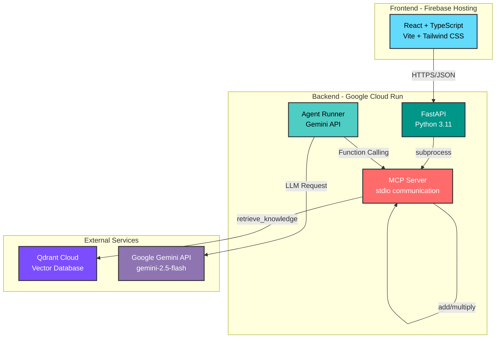

# DocuBrain Agent 🧠


## プロジェクト概要

**DocuBrain Agent** は、社内ドキュメント検索（RAG）と外部ツール実行を統合した、自律型AIエージェントシステムです。

ユーザーの自然言語による問いかけに対し、AIが「検索が必要か」「計算が必要か」を自律的に判断し、適切なツールを使用して回答します。単なるチャットボットではなく、**Agentic Workflow**を実装したインテリジェントなアシスタントです。

---

## デモ

**🚀 Live Demo**: [https://docubrain-prod-ae29a.web.app/](https://docubrain-prod-ae29a.web.app/)

実際に動作しているアプリケーションをお試しください！ChatGPTライクなインターフェースで、AIエージェントの自律的なツール選択と、根拠に基づいた回答生成を体験できます。

---

## 主な特徴

### 🤖 自律型エージェント (Agentic AI)
AIが状況に応じて最適なツールを選択・実行。ユーザーは「何を使うか」ではなく「何を知りたいか」だけを伝えればよい設計。

### 📚 RAG (Retrieval-Augmented Generation)
PDFドキュメントをベクトル検索し、根拠のある回答を生成。ハルシネーション（幻覚）を防ぎ、信頼性の高い情報提供を実現。

### 🔧 マルチツール統合
知識検索、計算ツールなど複数の機能を自律的に使い分け。今後の拡張も容易なアーキテクチャ。

### 🏗️ MCP (Model Context Protocol)
AnthropicやOpenAIも採用する業界標準プロトコルを採用。ツールとAIの疎結合を実現し、保守性・拡張性を向上。

### 💬 Intuitive UI/UX (直感的なインターフェース)
**ChatGPT-like interface** with advanced features:
- **マルチセッション管理**: 複数のチャット履歴をサイドバーで一元管理
- **永続化**: `localStorage` によるリロード耐性（会話が消えない）
- **レスポンシブデザイン**: モバイル/タブレット/デスクトップ完全対応
- **UXディテール**: Loading状態の可視化、IME対応、ソース引用の見やすい表示

### ☁️ フルクラウド
Firebase Hosting + Cloud Runでスケーラブルなインフラを実現。サーバーレス構成で運用コストを最小化。

---

## システムアーキテクチャ



### データフロー
1. **Frontend**: ユーザーがチャットUIで質問を入力
2. **FastAPI**: `/api/chat` エンドポイントでリクエストを受信
3. **Agent Runner**: Gemini APIにFunction Callingリクエストを送信
4. **MCP Server**: AIが選択したツール（`retrieve_knowledge`, `add`, `multiply`）を実行
5. **Qdrant**: RAGの場合、ベクトル検索で関連ドキュメントを取得
6. **Response**: AIが最終回答を生成し、フロントエンドに返却

---

## 使用技術

### Frontend
| Technology | Purpose |
|------------|---------|
| **React 18.3** | UI構築 - 宣言的なコンポーネント設計 |
| **TypeScript 5.6** | 型安全な開発 - バックエンドとのインターフェース共有 |
| **Vite** | 高速なビルドツール - HMR対応 |
| **Tailwind CSS** | ユーティリティファーストなスタイリング |
| **Axios** | 非同期HTTP通信 |
| **Firebase Hosting** | CDN配信 - 高速なコンテンツ配信 |

### Backend
| Technology | Purpose |
|------------|---------|
| **Python 3.11** | 高パフォーマンスなランタイム |
| **FastAPI** | 非同期API - OpenAPI自動生成 |
| **Pydantic** | 厳格な型検証 - リクエスト/レスポンススキーマ |
| **MCP (Model Context Protocol)** | AIツール連携の標準プロトコル |
| **Google Cloud Run** | サーバーレスコンテナ - 自動スケーリング |
| **Docker** | コンテナ化 - Multi-stage buildで軽量化 |

### AI & Data
| Technology | Purpose |
|------------|---------|
| **Google Gemini 2.5 Flash** | 高速な言語モデル - Function Calling対応 |
| **Qdrant Cloud** | マネージドベクトルDB - セマンティック検索 |
| **LangChain** | RAGパイプライン構築 |
| **Sentence Transformers** | テキストの埋め込みベクトル生成 |

### DevOps
| Technology | Purpose |
|------------|---------|
| **Cloud Build** | CI/CD - 自動ビルド・デプロイ |
| **Artifact Registry** | Dockerイメージ管理 |
| **Secret Manager** | APIキーの安全な管理 |

---

## 機能一覧

### 1. RAG (Retrieval-Augmented Generation)
- PDFドキュメントのアップロード・解析
- テキストのチャンク化とベクトル埋め込み
- Qdrantによるセマンティック検索
- 検索結果を根拠とした回答生成
- ソース引用の表示（どのドキュメントから情報を取得したか明示）

### 2. 自律型エージェント (Agentic Workflow)
- **自律的なツール選択**: AIがユーザーの意図を解析し、必要なツールを判断
- **Function Calling**: Gemini APIのネイティブ機能を活用
- **マルチステップ推論**: 複数のツールを組み合わせた複雑なタスクの実行

### 3. 提供ツール
| Tool | Description |
|------|-------------|
| `retrieve_knowledge` | Qdrantで社内ドキュメントを検索 |
| `add` | 2つの数値の加算 |
| `multiply` | 2つの数値の乗算 |

*(今後拡張可能: API呼び出し、データベースクエリ、外部サービス連携など)*

### 4. モダンなチャットUI
- **ChatGPTライクなインターフェース**: サイドバーで複数の会話を管理
- **セッション永続化**: `localStorage`によるリロード耐性
- **リアルタイムフィードバック**: Loading状態の可視化、自動スクロール
- **ソース引用の視覚化**: どのドキュメントから情報を取得したか一目で分かる表示
- **レスポンシブデザイン**: モバイル/タブレット/デスクトップ完全対応
- **IME対応**: 日本語入力中の誤送信防止

---

## 開発のこだわり (Technical Challenges)

このプロジェクトでは、単なるチュートリアル実装ではなく、実務レベルの技術的課題に取り組みました。

### 🚀 1. MCP (Model Context Protocol) の実装

**課題**: AIツール連携の標準化と疎結合化

従来のFunction Calling実装では、ツール定義とバックエンドロジックが密結合になりがちです。本プロジェクトでは、**MCP (Model Context Protocol)** を採用し、AIとツールを疎結合にする設計を実現しました。

#### 技術的な実装ポイント

**1. Dockerコンテナ内でのMCPサーバー起動**

Cloud Run環境でMCPサーバーをサブプロセスとして起動し、`stdio`通信で連携させる実装を行いました。

```python
# backend/app/services/mcp_client.py
async def start_mcp_server():
    """MCPサーバーをサブプロセスとして起動（stdio通信）"""
    server_params = StdioServerParameters(
        command="python",
        args=["/app/app/mcp/server.py"],  # 絶対パス指定が重要
        env=None
    )
    async with stdio_client(server_params) as (read, write):
        async with ClientSession(read, write) as session:
            await session.initialize()
            return session
```

**2. 絶対パスの解決**

当初、相対パス指定により Cloud Run 上でモジュールが見つからないエラーが発生。Dockerコンテナ内の絶対パス（`/app/app/mcp/server.py`）を指定することで解決しました。

**3. 非同期処理の徹底**

FastAPIの非同期ハンドラーと、MCPクライアントの非同期通信を適切に統合。

```python
async def run_agent(user_message: str) -> str:
    """エージェントを実行し、MCPツールを呼び出す"""
    async with get_mcp_session() as session:
        # ツールリストを取得
        tools_list = await session.list_tools()
        
        # Gemini APIにFunction Callingリクエスト
        response = model.generate_content(...)
        
        # AIが選択したツールをMCP経由で実行
        tool_result = await session.call_tool(tool_name, arguments=args)
```

#### なぜMCPを選んだか

- **拡張性**: 新しいツールの追加が容易（MCPサーバー側のみの変更で完結）
- **保守性**: ツールロジックとAIロジックの分離
- **標準化**: AnthropicやOpenAIも採用する業界標準プロトコル

---

### 🤖 2. 自律エージェント (Agentic Workflow) の構築

**課題**: AIによる動的なツール選択と実行

単なるチャットボットではなく、ユーザーの意図に応じて適切なツールを自律的に選択・実行するエージェントを実装しました。

#### 実装戦略

**1. Function Callingの活用**

Gemini APIのFunction Calling機能を使い、AIに「どのツールを使うか」を判断させました。

```python
tools = [
    {
        "name": "retrieve_knowledge",
        "description": "社内ドキュメントから関連情報を検索します",
        "parameters": {
            "type": "object",
            "properties": {
                "query": {"type": "string", "description": "検索クエリ"}
            }
        }
    },
    # ... 他のツール定義
]

model = genai.GenerativeModel(
    model_name="gemini-2.5-flash",
    tools=tools
)
```

**2. マルチターン対話**

AIがツールを実行した結果を受け取り、再度推論を行うマルチターン対話を実装。

```
User: "売上レポート2024のQ3実績は？"
  ↓
AI: retrieve_knowledge("売上レポート2024 Q3") を呼び出し
  ↓
Tool: [検索結果] "Q3実績: 1200万円"
  ↓
AI: "2024年Q3の売上実績は1200万円です。"
```

#### 工夫したポイント

- **意図分類の精度向上**: プロンプトエンジニアリングにより、適切なツール選択率を向上
- **エラーハンドリング**: ツール実行失敗時のフォールバック処理
- **コンテキスト管理**: 会話履歴を保持し、連続的な質問に対応

---

### 🔒 3. CORSとセキュリティ

**課題**: Cloud Run (Backend) と Firebase Hosting (Frontend) 間のセキュアな通信

#### 解決策

**1. CORSミドルウェアの設定**

```python
# backend/app/main.py
app.add_middleware(
    CORSMiddleware,
    allow_origins=[
        "https://docubrain-agent.web.app",
        "http://localhost:5173"  # 開発環境
    ],
    allow_credentials=True,
    allow_methods=["*"],
    allow_headers=["*"],
)
```

**2. 環境変数によるAPIキー管理**

```yaml
# Cloud Run デプロイ時
gcloud run deploy docubrain-backend \
  --set-env-vars GEMINI_API_KEY=secret:gemini-key \
  --set-env-vars QDRANT_API_KEY=secret:qdrant-key
```

**3. 型安全な通信**

フロントエンドとバックエンドでTypeScript/Pydanticのスキーマを共有し、実行時エラーを防止。

---

### � 4. フロントエンドの状態管理とUX設計

**課題**: 実用的なアプリとして使えるUI/UXの実現

単なるチャットボットではなく、「毎日使いたくなる」アプリを目指し、以下の設計を行いました。

#### 実装した工夫

**1. クライアントサイドセッション管理**

`useState` と `useEffect` を組み合わせ、複数のチャット履歴をReactの状態として管理。

```typescript
const [sessions, setSessions] = useState<ChatSession[]>([]);
const [currentSessionId, setCurrentSessionId] = useState<string | null>(null);

// セッション作成
const createNewSession = () => {
  const newSession: ChatSession = {
    id: Date.now().toString(),
    title: '新しいチャット',
    messages: [{ role: 'assistant', content: 'こんにちは！...' }],
    createdAt: Date.now(),
  };
  setSessions(prev => [newSession, ...prev]);
  setCurrentSessionId(newSession.id);
};
```

**2. LocalStorageによる永続化**

バックエンドに負荷をかけず、プライバシーを守りつつ履歴を保持。

```typescript
// 保存
useEffect(() => {
  if (sessions.length > 0) {
    localStorage.setItem('docubrain_sessions', JSON.stringify(sessions));
  }
}, [sessions]);

// 読み込み
useEffect(() => {
  const saved = localStorage.getItem('docubrain_sessions');
  if (saved) {
    const parsedSessions: ChatSession[] = JSON.parse(saved);
    setSessions(parsedSessions);
  }
}, []);
```

**3. UXディテールへのこだわり**

| 機能 | 実装内容 |
|------|----------|
| **IME対応** | `e.nativeEvent.isComposing` で日本語入力中の誤送信を防止 |
| **自動タイトル生成** | 最初のユーザー質問を会話タイトルに自動設定 |
| **自動スクロール** | メッセージ追加時に `scrollIntoView` で自動的に最下部へ |
| **Loading表示** | AIの思考中を視覚的にフィードバック |
| **レスポンシブ** | `md:` ブレークポイントでモバイル/デスクトップのレイアウト切り替え |

#### なぜこの設計にしたか

- **ステートレスバックエンド**: Cloud Runはリクエストごとにコンテナが起動・停止する。セッション管理をサーバー側で行うと、Redisなどの外部ストレージが必要になり複雑化。
- **MVP設計**: まずはクライアント側で完結させ、ユーザーが増えた段階でFirestore連携に移行する段階的な設計。
- **プライバシー**: サーバーに会話履歴を送らず、ブラウザ内で完結することでデータ主権を守る。

---

### ��️ 5. フルスタック実装

**課題**: フロントエンドからインフラまで一貫した設計・構築

#### 成果

- **設計**: システムアーキテクチャ、データフロー設計
- **フロントエンド**: React + TypeScript でのUI実装、状態管理、UXデザイン
- **バックエンド**: FastAPI での非同期API実装
- **AI統合**: Gemini API、Qdrantの統合、RAGパイプライン構築
- **インフラ**: Dockerコンテナ化、Cloud Buildによる CI/CD、Cloud Runへのデプロイ
- **デバッグ**: Cloud Runログの解析、パス解決問題の特定と修正

すべて一人で完遂し、実務レベルのフルスタック開発能力を証明しました。

---

## セットアップ手順

### 前提条件

- Node.js 18+
- Python 3.11+
- Docker & Docker Compose
- Google Cloud アカウント（Gemini API有効化）
- Qdrant Cloud アカウント

### 1. リポジトリのクローン

```bash
git clone https://github.com/yourusername/docubrain-agent.git
cd docubrain-agent
```

### 2. 環境変数の設定

#### Backend

```bash
# backend/.env
GEMINI_API_KEY=your_gemini_api_key
QDRANT_URL=https://your-cluster.qdrant.io
QDRANT_API_KEY=your_qdrant_api_key
QDRANT_COLLECTION_NAME=docubrain_knowledge
```

#### Frontend

```bash
# frontend/.env
VITE_API_BASE_URL=http://localhost:8000
```

### 3. ローカル開発環境の起動

#### バックエンド (Docker Compose)

```bash
docker-compose up --build
```

バックエンドが `http://localhost:8000` で起動します。

#### フロントエンド

```bash
cd frontend
npm install
npm run dev
```

フロントエンドが `http://localhost:5173` で起動します。

### 4. 動作確認

1. ブラウザで `http://localhost:5173` にアクセス
2. チャット画面で質問を入力（例: "売上レポートを教えて"）
3. AIがツールを選択し、回答が表示されることを確認

---

## プロジェクト構成

```
docubrain-agent/
├── frontend/                 # React + TypeScript
│   ├── src/
│   │   ├── components/      # UIコンポーネント
│   │   ├── api.ts          # バックエンド通信
│   │   ├── types.ts        # 型定義
│   │   └── App.tsx
│   ├── package.json
│   └── vite.config.ts
│
├── backend/                 # FastAPI + Python
│   ├── app/
│   │   ├── api/            # APIエンドポイント
│   │   │   └── agent.py
│   │   ├── services/       # ビジネスロジック
│   │   │   ├── agent_runner.py
│   │   │   ├── mcp_client.py
│   │   │   └── search.py
│   │   ├── mcp/           # MCPサーバー
│   │   │   └── server.py
│   │   ├── schemas/       # Pydanticスキーマ
│   │   └── main.py
│   ├── Dockerfile
│   └── pyproject.toml
│
├── docker-compose.yml
└── README.md
```

---

## デプロイ

### Cloud Run へのデプロイ

```bash
# Cloud Buildでビルド
gcloud builds submit --config cloudbuild.yaml

# Cloud Runにデプロイ
gcloud run deploy docubrain-backend \
  --image gcr.io/your-project-id/docubrain-backend \
  --platform managed \
  --region asia-northeast1 \
  --allow-unauthenticated \
  --set-env-vars GEMINI_API_KEY=secret:gemini-key
```

### Firebase Hosting へのデプロイ

```bash
cd frontend
npm run build
firebase deploy --only hosting
```

---

## 今後の展望

### 機能拡張
- [ ] **認証機能**: Firebase Authenticationによるユーザー管理
- [ ] **会話履歴の永続化**: Firestore連携
- [ ] **マルチユーザー対応**: ユーザーごとの知識ベース分離
- [ ] **ツールの拡充**: 
  - 外部API呼び出し（天気、ニュース等）
  - データベースクエリ実行
  - ファイル操作（PDF生成、Excel出力等）

### 技術改善
- [ ] **ストリーミングレスポンス**: リアルタイムな回答生成
- [ ] **キャッシング**: 検索結果のキャッシュで高速化
- [ ] **モニタリング**: Cloud Logging/Monitoring統合
- [ ] **テスト**: 単体テスト、E2Eテストの拡充

### UI/UX
- [ ] **マークダウン対応**: 回答のリッチテキスト表示
- [ ] **音声入力**: Speech-to-Text統合
- [ ] **多言語対応**: i18n実装

---

## ライセンス

MIT License

---

## 開発者

**Yuta Yokkaichi**

このプロジェクトは、モダンなフルスタック開発、AI統合、クラウドインフラ構築のスキルを証明するために作成されました。

技術的な質問やフィードバックは、GitHubのIssueまでお願いします。

---

**Built with ❤️ and cutting-edge technology**
